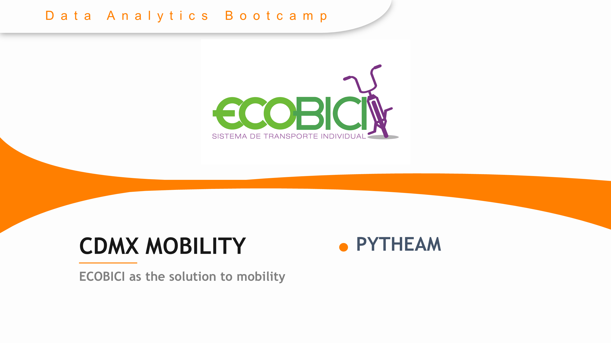

# Pytheam - Project 1
----

### Summary

ECOBICI is a public bikeshare system that allows the user to pick up a bike in one place and return it to another, making point-to-point, human-powered transportation practical.

__HYPOTESIS__

__H0=𝐸𝐶𝑂𝐵𝐼𝐶𝐼 𝑖𝑠 𝑎 𝑚𝑜𝑏𝑖𝑙𝑖𝑡𝑦 𝑠𝑜𝑙𝑢𝑡𝑖𝑜𝑛 𝑓𝑜𝑟 𝑀𝑒𝑥𝑖𝑐𝑜 𝐶𝑖𝑡𝑦__

__Scope__

Assess whether public bikeshare system (ECOBICI) is a mobility solution for Mexico City, through the analysis of several data sources.

---
